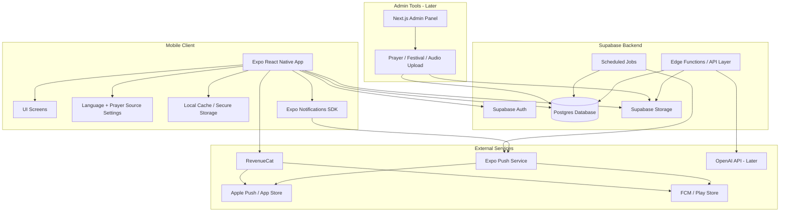
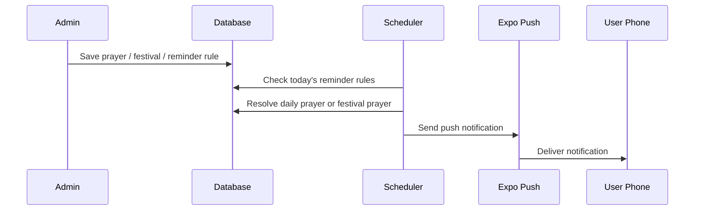
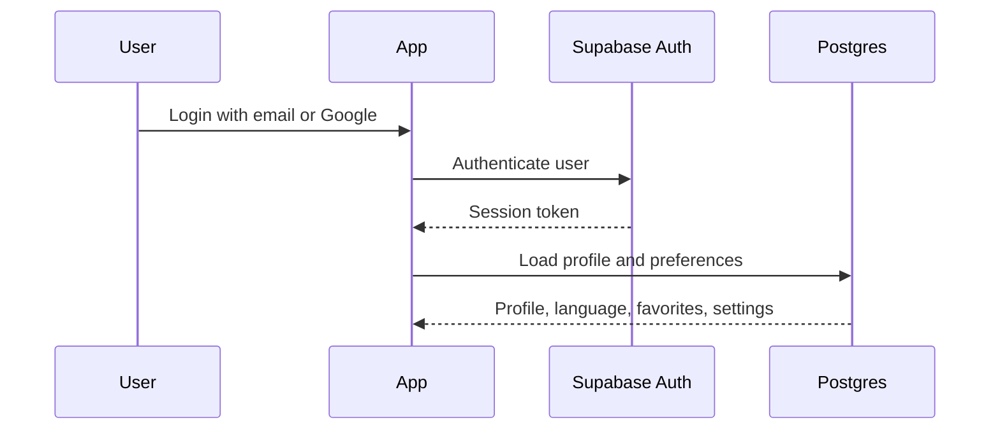

# Devotional Prayer App - Detailed Architecture

## Final Recommended Stack

- Mobile client: Expo + React Native + TypeScript
- Navigation: React Navigation
- State: Context or Zustand
- Backend platform: Supabase
- Auth: Supabase Auth
- Database: Postgres on Supabase
- File storage: Supabase Storage
- Push notifications: Expo Notifications + Expo Push Service
- Background jobs: Supabase Edge Functions / cron job
- Analytics later: PostHog or Firebase Analytics
- Error monitoring later: Sentry
- Subscription later: RevenueCat
- Admin CMS later: Next.js + Supabase

## Detailed Diagram

## App Layers

### 1. Mobile App Layer

- Splash screen
- Login / signup
- Home
- Search
- Audio prayers
- Reminders
- Profile
- Favorites
- Prayer detail

Responsibilities:

- show UI in selected app language
- load prayer content in selected prayer language
- authenticate users
- fetch content from backend
- play audio
- register device for notifications

### 2. Backend Layer

Responsibilities:

- store users
- store prayers by language
- store deity and festival metadata
- store reminder rules
- store audio links
- send scheduled notifications
- secure data access using row-level security

## Proposed Database Modules

### Core content

- `deities`
- `prayers`
- `prayer_contents`
- `prayer_audio_tracks`
- `festivals`
- `festival_prayers`

### User data

- `users`
- `user_profiles`
- `user_favorites`
- `user_preferences`
- `user_devices`

### Reminder system

- `reminder_rules`
- `festival_calendar`
- `notification_logs`

### Subscription later

- `subscription_features`
- `user_entitlements`

## Suggested Table Responsibilities

### `deities`

- deity id
- display names by language
- icon / theme colors

### `prayers`

- prayer id
- deity id
- category like aarti / chalisa / mantra
- estimated duration
- featured flag

### `prayer_contents`

- prayer id
- content language
- display title
- transliterated title if needed
- full verses / structured sections

### `prayer_audio_tracks`

- prayer id
- audio file path
- duration
- language
- narrator / singer metadata

### `festivals`

- festival id
- localized names
- description
- ritual guide summary later

### `festival_calendar`

- festival id
- date
- region if needed later
- source metadata

### `reminder_rules`

- rule type: daily or festival
- day mapping
- target prayer id
- send time
- enabled flag

## Notification Flow

## Authentication Flow

## Future Vision Mapping

### Festival guided steps

- add `festival_guides` and `festival_guide_steps`

### Audio prayers

- already supported through `prayer_audio_tracks`

### Children explanation and chatbot

- add `prayer_meanings`
- add AI endpoint using OpenAI later

### Community for users abroad

- add community tables later
- posts, groups, event invites, moderation

### Subscription features

- RevenueCat controls premium entitlements
- app unlocks audio, guides, AI, and community features based on entitlement

## Deployment Path

### Development

- local development with Expo
- test on iPhone using Expo Go / development builds

### Beta

- iOS via TestFlight
- Android via internal testing on Play Console

### Production

- App Store release
- Play Store release

## Recommended Build Order

1. Rebuild approved UI in Expo React Native
2. Set up navigation and shared theme
3. Add Supabase project and schema
4. Add login / signup / Google login
5. Add prayer content APIs
6. Add reminders and notifications
7. Add audio support
8. Add subscriptions later
