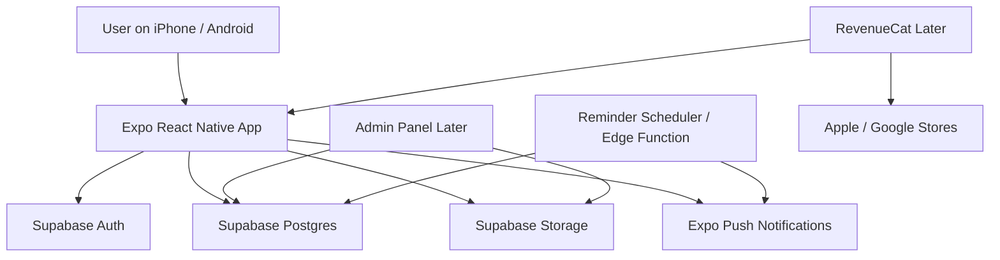

# Devotional Prayer App - Simple Architecture

## Recommended Stack

- Mobile App: Expo + React Native + TypeScript
- Backend: Supabase
- Auth: Supabase Auth
- Database: Supabase Postgres
- Storage: Supabase Storage
- Notifications: Expo Notifications + backend scheduler
- Subscriptions later: RevenueCat
- Admin panel later: Next.js web app

## Simple Diagram

## How It Works

1. User opens the mobile app.
2. User logs in with email or Google.
3. App loads prayers, festivals, reminders, and profile data from Supabase.
4. Audio files and profile photos are loaded from Supabase Storage.
5. Reminder logic runs from backend rules and sends push notifications through Expo.
6. Later, subscriptions can be managed using RevenueCat.

## Main Benefits

- One codebase for iPhone and Android
- Lower initial cost
- Clean support for multilingual content
- Easy path for future audio, subscriptions, chatbot, and community features
